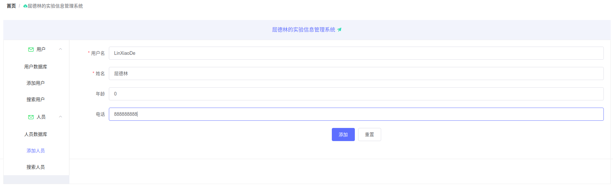
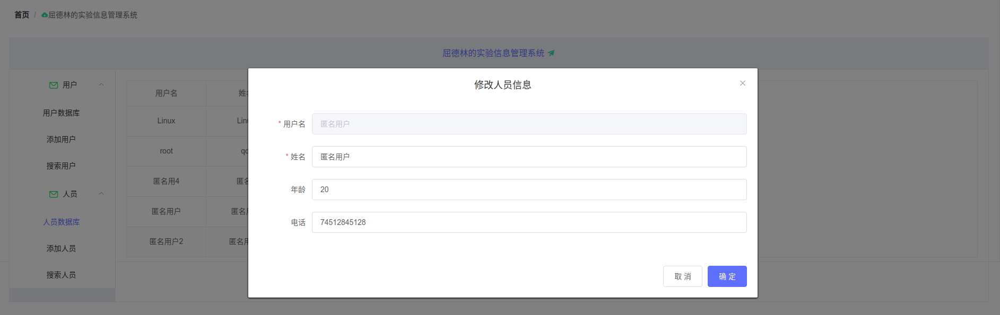

# SpringBoot-Vue-CURD


enjoy it !


## 介绍

这是编程务实实验lab1&2，我将lab1和lab2结合起来，使用springBoot+vue前后端分离实现了一个简单的CRUD项目，部署在宿舍服务器上，你可以通过网址访问它 [http://hnu203.com:8181/](http://hnu203.com:8181/)

- 主页


- 添加人员信息



- 修改信息：



- 删除人员


## 技术栈和环境

**技术栈**

> 后端

- `springBoot`
- `mybatis`
- `mySQL`
- `pageHelper`

> 前端

- `Vue`
- `axios`
- `elemet`

**环境**

- 操作系统：Linux / windows
- 软件：`IDEA`，`VsCode`
- 服务器


## 入口地址

- 前端地址：[VueLab](https://github.com/LinXiaoDe/springBoot-Vue-CRUD/vueLab)
- 后端地址：[lab](https://github.com/LinXiaoDe/springBoot-Vue-CRUD/lab)


## 项目目录结构

```bash
$ tree -d
.
├── lab
│   └── src
│       ├── main
│       │   ├── java
│       │   │   └── com
│       │   │       └── lin
│       │   │           ├── config
│       │   │           ├── controller
│       │   │           ├── entity
│       │   │           ├── mapper
│       │   │           ├── service
│       │   │           └── utils
│       │   └── resources
│       │       ├── mappers
│       │       ├── static
│       │       │   ├── css
│       │       │   ├── fonts
│       │       │   └── js
│       │       └── templates
│       └── test
│           └── java
│               └── com
│                   └── lin
│                       └── mapper
├── README.assets
└── VueLab
    ├── public
    └── src
        ├── assets
        ├── components
        ├── plugins
        ├── router
        ├── store
        └── views
```

